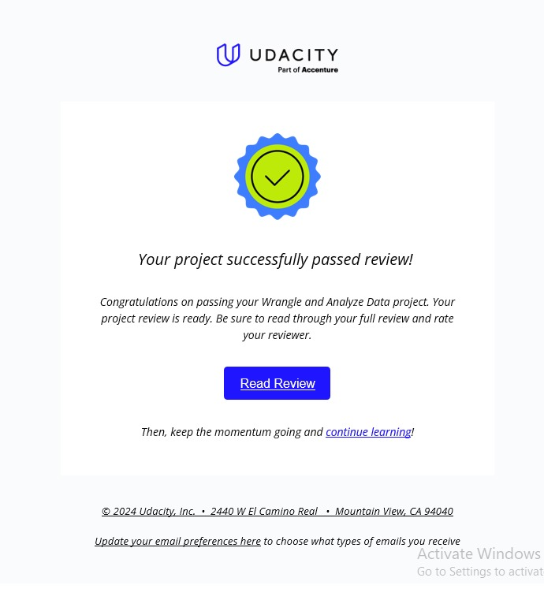

# Wrangle and Analyze Data
This a project related to **DECI Y2 L3 Data Analysis & AI** for the End-of-term project for this year.

I was asked to do gather data from (3) different resources related to the Twitter account [WeRateDogs](https://x.com/dog_rates/)

This project focuses on the whole process:
- Gathering
- Assessment
- Cleaning
- Storing
- Analysis & Visualization
- Reporting

And then, I was asked to investigate that dataset and perform the whole data analysis process under the guidance of my instructors. That was a great opportunity to apply the concepts I've learnt in the past 3 months.

I submitted the project on 16/7/2024. And I got a perfect score on the fourth try.

